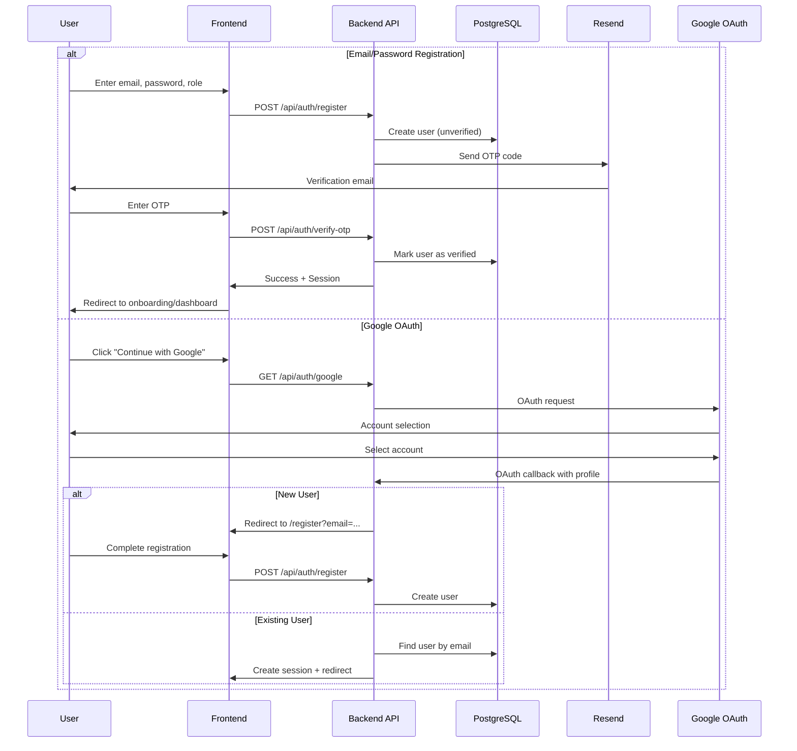
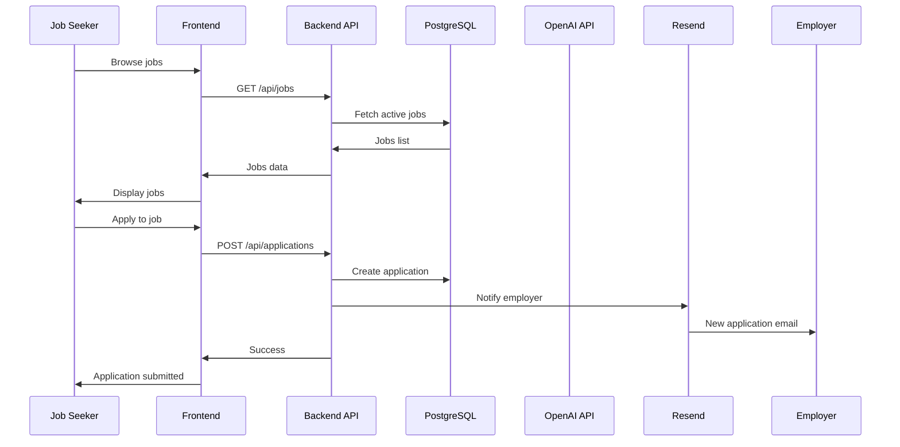
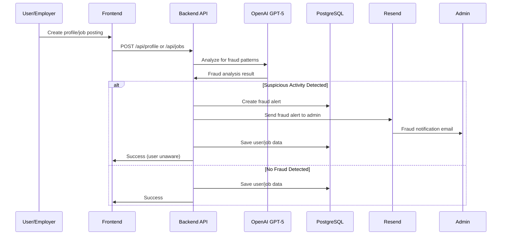
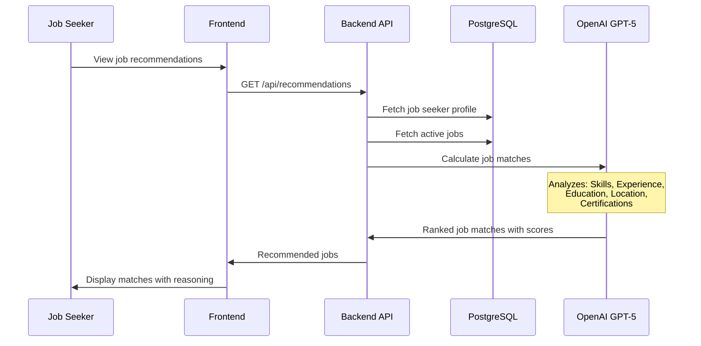
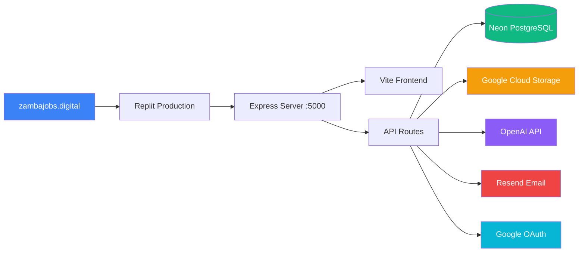

# ZambaJobs System Architecture

## System Block Diagram

```mermaid
graph TB
    subgraph "Client Layer"
        A[Web Browser<br/>React + TypeScript + Vite]
    end
    
    subgraph "Frontend Components"
        A --> B[Authentication Pages<br/>Login, Register, OTP]
        A --> C[Job Seeker Dashboard<br/>Profile, Applications, Recommendations]
        A --> D[Employer Dashboard<br/>Job Posting, Applicant Management]
        A --> E[Admin Dashboard<br/>User/Job/Fraud Management]
    end
    
    subgraph "Backend Layer - Express.js API"
        B --> F[Auth Routes<br/>/api/auth/*]
        C --> G[Profile Routes<br/>/api/profile]
        C --> H[Jobs Routes<br/>/api/jobs]
        D --> I[Employer Routes<br/>/api/employer/*]
        E --> J[Admin Routes<br/>/api/admin/*]
        
        F --> K[Session Middleware<br/>Passport.js]
        G --> K
        H --> K
        I --> K
        J --> K
    end
    
    subgraph "Authentication Services"
        K --> L[Email/Password Auth<br/>Bcrypt + JWT]
        K --> M[Google OAuth 2.0<br/>passport-google-oauth20]
        K --> N[OTP Verification<br/>10-min expiry]
    end
    
    subgraph "Data Layer"
        F --> O[Storage Interface<br/>IStorage]
        G --> O
        H --> O
        I --> O
        J --> O
        
        O --> P[(PostgreSQL Database<br/>Neon Serverless)]
        
        subgraph "Database Schema"
            P --> P1[Users Table<br/>role-based access]
            P --> P2[JobSeekerProfiles]
            P --> P3[EmployerProfiles]
            P --> P4[Jobs Table]
            P --> P5[Applications]
            P --> P6[FraudAlerts]
            P --> P7[WorkExperience]
            P --> P8[Education]
            P --> P9[Certifications]
            P --> P10[Sessions]
        end
    end
    
    subgraph "AI Services"
        O --> Q[OpenAI GPT-5 API]
        Q --> Q1[Fraud Detection<br/>Profile & Job Analysis]
        Q --> Q2[Smart Job Matching<br/>Candidate Scoring]
    end
    
    subgraph "File Storage"
        G --> R[Google Cloud Storage]
        R --> R1[Profile Pictures<br/>Public Access]
        R --> R2[Resume/CV Files<br/>Private Access]
    end
    
    subgraph "Email Services"
        F --> S[Resend Email API]
        S --> S1[OTP Verification Emails]
        S --> S2[Password Reset Links]
        S --> S3[Application Notifications]
        S --> S4[Fraud Alert Notifications]
    end
    
    subgraph "External Authentication"
        M --> T[Google OAuth Provider<br/>Google Cloud Console]
    end
    
    style A fill:#3b82f6,color:#fff
    style P fill:#10b981,color:#fff
    style Q fill:#8b5cf6,color:#fff
    style R fill:#f59e0b,color:#fff
    style S fill:#ef4444,color:#fff
    style T fill:#06b6d4,color:#fff
```

## Data Flow Diagrams

### 1. User Registration & Authentication Flow

### 2. Job Application Flow

### 3. AI Fraud Detection Flow

### 4. AI Job Matching Flow

## Technology Stack

### Frontend
- **Framework**: React 18 with TypeScript
- **Build Tool**: Vite
- **Routing**: Wouter
- **State Management**: TanStack Query (React Query v5)
- **Forms**: React Hook Form + Zod validation
- **UI Components**: Shadcn/ui + Radix UI primitives
- **Styling**: Tailwind CSS
- **Icons**: Lucide React

### Backend
- **Runtime**: Node.js 20
- **Framework**: Express.js
- **Language**: TypeScript
- **ORM**: Drizzle ORM
- **Authentication**: Passport.js (Local + Google OAuth)
- **Session**: express-session with PostgreSQL store
- **Password Hashing**: Bcrypt
- **Tokens**: JWT

### Database
- **Database**: PostgreSQL (Neon Serverless)
- **Schema Management**: Drizzle Kit

### External Services
- **AI**: OpenAI GPT-5 API
- **Storage**: Google Cloud Storage
- **Email**: Resend API
- **OAuth**: Google OAuth 2.0

### DevOps
- **Hosting**: Replit
- **Domain**: zambajobs.digital
- **Environment**: Development & Production

## Security Features

1. **Authentication**
   - Multi-factor with OTP (10-min expiry, 5-attempt lockout)
   - Password hashing with Bcrypt
   - JWT tokens for stateless auth
   - Session management with PostgreSQL
   - Rate limiting on auth endpoints

2. **Authorization**
   - Role-based access control (job_seeker, employer, admin)
   - Route-level middleware protection
   - Resource ownership validation

3. **Data Protection**
   - SQL injection prevention (parameterized queries)
   - XSS protection
   - CORS configuration
   - Secure file uploads with validation
   - Private file access control

4. **AI-Powered Fraud Detection**
   - Automated profile analysis
   - Job posting validation
   - Confidence scoring system
   - Admin notification system

## Key Features

### For Job Seekers
- Profile management with work experience, education, certifications
- Resume/CV upload
- AI-powered job recommendations
- Application tracking
- Personal analytics dashboard

### For Employers
- Job posting management
- Applicant portfolio viewer
- Application filtering
- Job performance analytics

### For Admins
- User management (view, delete, create admins)
- Job management (view, flag, delete)
- Fraud alert monitoring with detailed views
- Platform-wide analytics
- CSV export functionality

## Deployment Architecture

---

**Last Updated**: November 19, 2025
